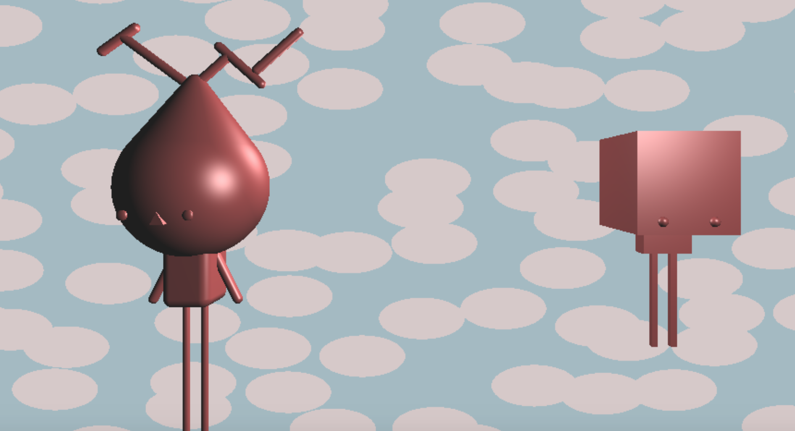
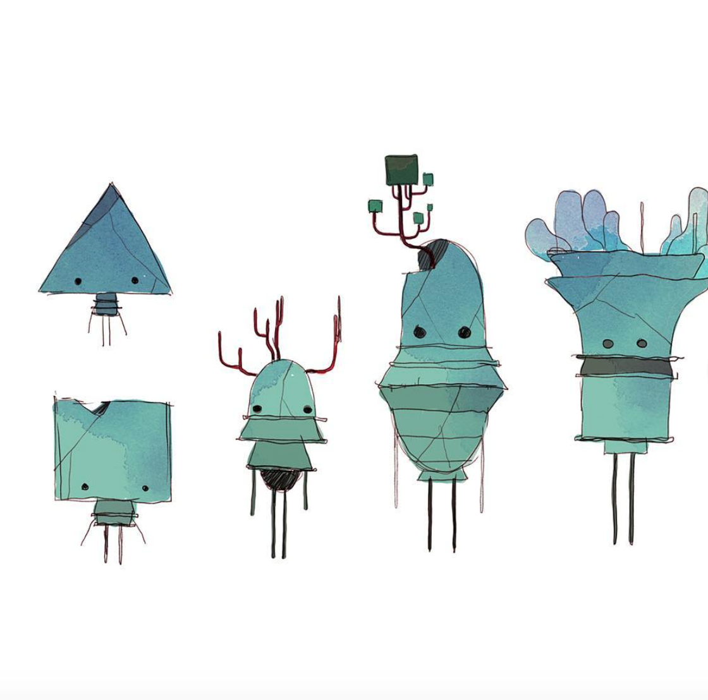

# raymarching with signed distance functions
by Annie Su, anniesu1

## Inspiration
I have lately been drawing a lot of creatures and goops and wanted to translate them from 2D paper into 3D digital form.

[here](https://www.instagram.com/p/BsxMPLeAOLa/)

## Implementation
- Body: the bodies of each goop is constructed entirely using SDF's (referenced from Inigo Quilez). The box goop is made using SDF boxes of varying length, width, and height. Its eyes are SDF spheres. 
The goop with antlers is made from round cones, round boxes, ellipsoids (eyes), triprism (for the nose), and capsules (limbs). To construct
the composite body, the SDF union function was used. 
- Animation: the box goop has a y-displacement based on time using a triangle wave with an amplitude and frequency of 1.0. 
This creates a crisper, bouncy motion. The antler goop has a y-displacement based on time using a sin function, which creates a 
smoother oscillation in height. The user may alter the speed of this animation using the GUI input time_slow_down. The higher the 
time_slow_down value, the slower the creatures bob up and down. This is done by dividing the time component argument to each wave function by 
10 * time_slow_down factor.
- Normals: the normals are approximated by calculating a slope gradient (adding a small displacement in the positive and negative direction, and calculating the slope).
- Normal applied to lighting: the normals are then used to calculate lighting using the blinn-phong lighting model. 
- Optimization of ray marching: I optimized ray marching by implementing bounding volume hierarchy. Each creature is bounded by a bounding box. 
I then perform a test to see if the ray intersects the bounding volume. The optimization allows me to immediately return that the ray did not 
intersect any volume.
- Background: the polka dot background is created using worley noise. Based on the noise [0, 1) value returned, this background pixel is either colored
blue or pink if it is within a certain threshold. 

## External Resources
- Read about SDF's and referenced intersection, union, and differrence SDF functions from [here](http://jamie-wong.com/2016/07/15/ray-marching-signed-distance-functions/#surface-normals-and-lighting)
- Referenced blinn-phong lighting method from [here](https://www.shadertoy.com/view/Xtd3z7)
- Learned about SDF's from [this blog post](http://www.iquilezles.org/www/articles/distfunctions/distfunctions.html)
- Referenced multiple SDF functions for basic primitives from [here](https://www.shadertoy.com/view/Xds3zN)
- Followed CIS-460 lectures slides for ray casting implementation from [here](https://docs.google.com/presentation/d/e/2PACX-1vSN5ntJISgdOXOSNyoHimSVKblnPnL-Nywd6aRPI-XPucX9CeqzIEGTjFTwvmjYUgCglTqgvyP1CpxZ/pub?start=false&loop=false&delayms=60000&slide=id.g27215b64c6_0_107)
- Read about Bounding Volume Hierarchies [here](https://www.scratchapixel.com/lessons/advanced-rendering/introduction-acceleration-structure/bounding-volume)
- Referenced ray-box intersection implementation from [here](https://www.scratchapixel.com/lessons/3d-basic-rendering/minimal-ray-tracer-rendering-simple-shapes/ray-box-intersection)
- Referenced Toolbox Functions slides for triangle wave implementation

## Link to github.io Demo
https://anniesu1.github.io/hw02-raymarching-sdfs/
